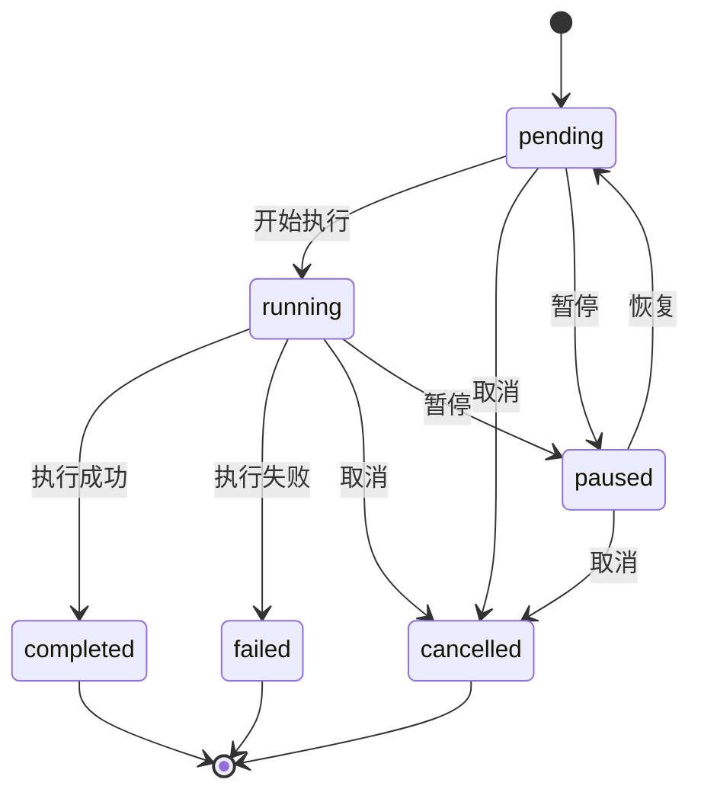

# 命令管理 API

> **最后更新**: 2025-06-20  
> **文档状态**: 正式发布

---

## 接口概览

| 接口 | 方法 | 路径 | 描述 | 权限 |
|------|------|------|------|------|
| 创建命令 | POST | `/commands` | 创建新命令 | 需要登录 |
| 获取命令列表 | GET | `/commands` | 获取命令列表 | 需要登录 |
| 获取命令详情 | GET | `/commands/{id}` | 获取命令详细信息 | 需要登录 |
| 更新命令状态 | PUT | `/commands/{id}` | 暂停/恢复/取消命令 | 需要登录 |
| 获取命令结果 | GET | `/commands/{id}/results` | 获取命令执行结果 | 需要登录 |

---

## 设计理念

### 任务执行模式

1. **客户端主动抓取**：服务端不主动推送任务，客户端定期轮询获取需要执行的任务
2. **定时任务处理**：cron类型的任务由客户端根据schedule字段自行调度执行
3. **执行结果存储**：每次执行都会创建新的Execution记录，支持多次执行结果存储

### 命令类型说明

| 类型      | 描述           | 是否需要 schedule | 执行方式 |
| --------- | -------------- | ----------------- | -------- |
| once      | 一次性任务     | 否                | 服务端调度 |
| cron      | 按计划重复执行 | 是                | 客户端执行 |
| immediate | 立即下发命令   | 否                | 服务端调度 |

---

## 创建命令

### `POST /commands`

创建新命令，支持一次性、定时和立即执行。

**请求参数**：

```json
{
  "name": "安全更新",
  "type": "cron",
  "schedule": "0 3 * * *",
  "content": "apt update && apt upgrade -y",
  "target_type": "groups",
  "target_ids": ["grp_web001"],
  "timeout": 1800,
  "env_vars": {
    "DEBIAN_FRONTEND": "noninteractive"
  },
  "retry_policy": {
    "enabled": true,
    "max_attempts": 3
  }
}
```

| 参数名       | 类型   | 必填 | 说明                    |
| ------------ | ------ | ---- | ----------------------- |
| name         | string | 是   | 命令名称（1-100字符）   |
| type         | string | 是   | 命令类型                |
| schedule     | string | 否   | cron 表达式（定时任务） |
| content      | string | 是   | 命令内容                |
| target_type  | string | 是   | 目标类型                |
| target_ids   | array  | 是   | 目标ID列表              |
| timeout      | int    | 否   | 超时时间（秒，默认1800） |
| env_vars     | object | 否   | 环境变量                |
| retry_policy | object | 否   | 重试策略                |

**成功响应** (201)：

```json
{
  "code": 20000,
  "message": "命令创建成功",
  "data": {
    "id": "cmd_update001",
    "name": "安全更新",
    "type": "cron",
    "status": "pending",
    "created_at": "2025-06-20T14:30:00Z"
  }
}
```

**错误响应**：

| 错误码 | HTTP 状态 | 说明           |
| ------ | --------- | -------------- |
| 40004  | 400       | 参数缺失或格式错误 |
| 40008  | 400       | 数据验证失败   |
| 60001  | 400       | 不支持的命令类型 |
| 60002  | 400       | cron 表达式无效 |
| 60003  | 409       | 命令重复       |

**示例**：

```bash
curl -X POST https://api.cslite.com/commands \
  -H "Content-Type: application/json" \
  -H "Cookie: session=sess_abc123def456" \
  -d '{
    "name": "安全更新",
    "type": "cron",
    "schedule": "0 3 * * *",
    "content": "apt update && apt upgrade -y",
    "target_type": "groups",
    "target_ids": ["grp_web001"],
    "timeout": 1800,
    "env_vars": {
      "DEBIAN_FRONTEND": "noninteractive"
    }
  }'
```

---

## 获取命令列表

### `GET /commands`

获取命令列表，支持分页和过滤。

**查询参数**：

| 参数名 | 类型   | 必填 | 说明                    |
| ------ | ------ | ---- | ----------------------- |
| status | string | 否   | 命令状态过滤            |
| type   | string | 否   | 命令类型过滤            |
| device | string | 否   | 关联设备ID              |
| owner  | int    | 否   | 创建者用户ID（仅管理员） |
| page   | int    | 否   | 页码（默认1）           |
| limit  | int    | 否   | 每页数量（默认20）      |

**命令状态说明**：

| 状态      | 描述     |
| --------- | -------- |
| pending   | 等待调度 |
| running   | 正在执行 |
| completed | 已完成   |
| failed    | 执行失败 |
| paused    | 已暂停   |
| cancelled | 已取消   |

**成功响应** (200)：

```json
{
  "code": 20000,
  "message": "获取成功",
  "data": {
    "total": 3,
    "page": 1,
    "per_page": 5,
    "commands": [
      {
        "id": "cmd_update001",
        "name": "安全更新",
        "type": "cron",
        "status": "pending",
        "next_run": "2025-06-21T03:00:00Z",
        "created_at": "2025-06-20T14:30:00Z"
      },
      {
        "id": "cmd_backup002",
        "name": "数据备份",
        "type": "once",
        "status": "completed",
        "created_at": "2025-06-19T10:00:00Z"
      }
    ]
  }
}
```

**错误响应**：

| 错误码 | HTTP 状态 | 说明           |
| ------ | --------- | -------------- |
| 40003  | 401       | 登录状态已过期 |
| 40004  | 400       | 参数格式错误   |

**示例**：

```bash
curl -X GET "https://api.cslite.com/commands?status=pending&page=1&limit=10" \
  -H "Cookie: session=sess_abc123def456"
```

---

## 获取命令详情

### `GET /commands/{id}`

获取指定命令的详细信息。

**路径参数**：

| 参数名 | 类型   | 必填 | 说明   |
| ------ | ------ | ---- | ------ |
| id     | string | 是   | 命令ID |

**成功响应** (200)：

```json
{
  "code": 20000,
  "message": "获取成功",
  "data": {
    "id": "cmd_update001",
    "name": "安全更新",
    "type": "cron",
    "schedule": "0 3 * * *",
    "content": "apt update && apt upgrade -y",
    "status": "pending",
    "target_type": "groups",
    "target_ids": ["grp_web001"],
    "timeout": 1800,
    "env_vars": {
      "DEBIAN_FRONTEND": "noninteractive"
    },
    "retry_policy": {
      "enabled": true,
      "max_attempts": 3
    },
    "created_by": 1001,
    "created_at": "2025-06-20T14:30:00Z",
    "next_run": "2025-06-21T03:00:00Z",
    "execution_history": [
      {
        "id": "exec_20250619",
        "status": "completed",
        "started_at": "2025-06-19T03:05:00Z",
        "completed_at": "2025-06-19T03:15:00Z"
      }
    ]
  }
}
```

**错误响应**：

| 错误码 | HTTP 状态 | 说明           |
| ------ | --------- | -------------- |
| 40020  | 404       | 命令不存在     |
| 40002  | 403       | 权限不足       |

**示例**：

```bash
curl -X GET https://api.cslite.com/commands/cmd_update001 \
  -H "Cookie: session=sess_abc123def456"
```

---

## 更新命令状态

### `PUT /commands/{id}`

暂停、恢复或取消命令。

**路径参数**：

| 参数名 | 类型   | 必填 | 说明   |
| ------ | ------ | ---- | ------ |
| id     | string | 是   | 命令ID |

**请求参数**：

```json
{
  "action": "pause"
}
```

| 参数名 | 类型   | 必填 | 说明                    |
| ------ | ------ | ---- | ----------------------- |
| action | string | 是   | 操作类型（pause/resume/cancel） |

**操作类型说明**：

| 操作    | 描述     | 适用状态                    |
| ------- | -------- | --------------------------- |
| pause   | 暂停命令 | pending, running            |
| resume  | 恢复命令 | paused                      |
| cancel  | 取消命令 | pending, running, paused    |

**成功响应** (200)：

```json
{
  "code": 20000,
  "message": "命令已暂停",
  "data": {
    "updated_at": "2025-06-20T15:00:00Z"
  }
}
```

**错误响应**：

| 错误码 | HTTP 状态 | 说明           |
| ------ | --------- | -------------- |
| 40020  | 404       | 命令不存在     |
| 40021  | 409       | 命令状态不允许该操作 |
| 40002  | 403       | 权限不足       |

**示例**：

```bash
curl -X PUT https://api.cslite.com/commands/cmd_update001 \
  -H "Content-Type: application/json" \
  -H "Cookie: session=sess_abc123def456" \
  -d '{
    "action": "pause"
  }'
```

---

## 获取命令结果

### `GET /commands/{id}/results`

获取命令执行结果明细。

**路径参数**：

| 参数名 | 类型   | 必填 | 说明   |
| ------ | ------ | ---- | ------ |
| id     | string | 是   | 命令ID |

**查询参数**：

| 参数名 | 类型   | 必填 | 说明           |
| ------ | ------ | ---- | -------------- |
| page   | int    | 否   | 页码（默认1）  |
| limit  | int    | 否   | 每页数量（默认20） |

**成功响应** (200)：

```json
{
  "code": 20000,
  "message": "获取成功",
  "data": {
    "command_id": "cmd_update001",
    "executions": [
      {
        "id": "exec_20250619",
        "status": "completed",
        "started_at": "2025-06-19T03:05:00Z",
        "completed_at": "2025-06-19T03:15:00Z",
        "device_results": [
          {
            "device_id": "dev_abc123",
            "status": "completed",
            "exit_code": 0,
            "output": "成功更新15个软件包",
            "log_url": "https://api.cslite.com/logs/exec_20250619_dev_abc123.log"
          },
          {
            "device_id": "dev_def456",
            "status": "failed",
            "exit_code": 1,
            "output": "更新失败：网络连接错误",
            "log_url": "https://api.cslite.com/logs/exec_20250619_dev_def456.log"
          }
        ]
      }
    ]
  }
}
```

**错误响应**：

| 错误码 | HTTP 状态 | 说明           |
| ------ | --------- | -------------- |
| 40020  | 404       | 命令不存在     |
| 40002  | 403       | 权限不足       |

**示例**：

```bash
curl -X GET "https://api.cslite.com/commands/cmd_update001/results?page=1&limit=10" \
  -H "Cookie: session=sess_abc123def456"
```

---

## 命令调度流程

### 1. 命令创建流程

```
用户创建命令 → 验证参数 → 保存到数据库 → 根据类型调度
```

### 2. 命令执行流程

```
创建命令 → 创建执行记录 → 下发到目标设备 → Agent 执行 → 结果上报 → 状态更新
```

### 3. 状态转换图



---

## 权限说明

### 命令权限

| 操作 | 普通用户 | 管理员 | 说明 |
|------|----------|--------|------|
| 创建命令 | ✓ | ✓ | 只能对自己的设备执行 |
| 查看自己的命令 | ✓ | ✓ | 只能查看自己创建的 |
| 查看所有命令 | ✗ | ✓ | 管理员可以查看所有 |
| 管理命令状态 | ✓ | ✓ | 只能管理自己的命令 |
| 删除命令 | ✓ | ✓ | 只能删除自己的命令 |

### 目标设备权限

- 普通用户只能对属于自己的设备执行命令
- 管理员可以对所有设备执行命令
- 群组命令会检查群组内设备的权限

---

## 最佳实践

### 1. 命令设计

**安全性**：
- 避免执行危险命令（如 `rm -rf /`）
- 使用参数化命令防止注入
- 限制命令执行权限

**可靠性**：
- 设置合理的超时时间
- 配置重试策略
- 记录详细执行日志

### 2. 执行策略

**批量执行**：
- 合理选择目标设备
- 分批执行避免系统负载过高
- 监控执行进度

### 3. 监控告警

**执行监控**：
- 监控命令执行成功率
- 设置失败告警阈值
- 跟踪执行时间趋势

**资源监控**：
- 监控目标设备资源使用
- 避免并发执行过多命令
- 设置资源使用限制

---

## 计划项说明

- 命令过滤、加密、性能优化等内容详见[计划任务文档](../../development/plans.md)

---

## 相关文档

- [权限控制](./permissions.md) - 用户角色和权限说明
- [设备管理](./devices.md) - 设备管理接口
- [群组管理](./groups.md) - 群组管理接口
- [日志系统](./logs.md) - 日志查询接口 
