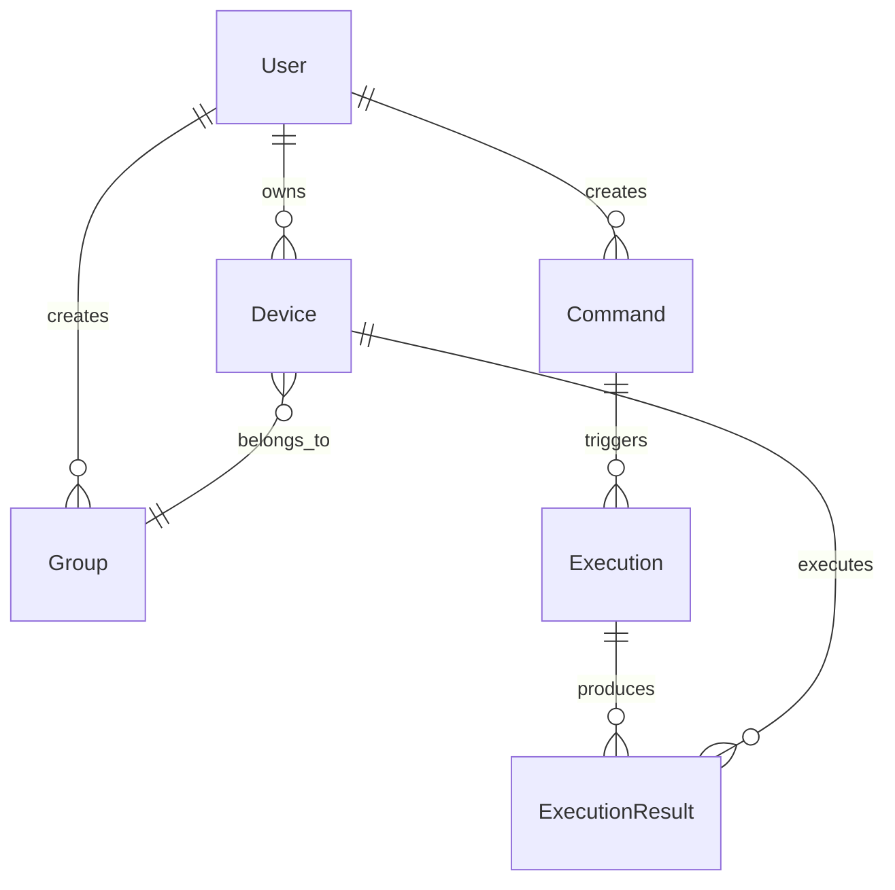

# 数据模型

> **最后更新**: 2025-06-20  
> **文档状态**: 正式发布

---

## ER 图



---

## 核心模型

### 用户模型 `User`

```go
type User struct {
    ID        uint      `gorm:"primaryKey"`
    Username  string    `gorm:"uniqueIndex;size:50;not null"`
    Password  string    `gorm:"size:255;not null"` // bcrypt 哈希
    Email     string    `gorm:"size:100;index"`
    Role      int       `gorm:"default:0"` // 0: 普通用户, 1: 管理员
    CreatedAt time.Time
    UpdatedAt time.Time
    DeletedAt gorm.DeletedAt `gorm:"index"`
}
```

| 字段名    | 类型     | 说明           | 约束           |
| --------- | -------- | -------------- | -------------- |
| ID        | uint     | 用户唯一 ID    | 主键，自增     |
| Username  | string   | 用户名         | 唯一，非空     |
| Password  | string   | 哈希加密密码   | 非空，bcrypt   |
| Email     | string   | 邮箱地址       | 可选，索引     |
| Role      | int      | 权限角色       | 0:用户 1:管理员 |
| CreatedAt | datetime | 创建时间       | 自动设置       |
| UpdatedAt | datetime | 更新时间       | 自动更新       |
| DeletedAt | datetime | 软删除时间     | 软删除支持     |

---

### 设备模型 `Device`

```go
type Device struct {
    ID         string    `gorm:"primaryKey;size:50"`
    Name       string    `gorm:"size:100;not null"`
    Platform   string    `gorm:"size:50;not null"` // linux/amd64, windows/amd64
    OwnerID    uint      `gorm:"not null;index"`
    GroupID    string    `gorm:"size:50;index"`
    Status     string    `gorm:"size:20;default:'offline'"` // online, offline, busy
    LastSeen   time.Time
    IPAddress  string    `gorm:"size:45"` // IPv4/IPv6
    CreatedAt  time.Time
    UpdatedAt  time.Time
    DeletedAt  gorm.DeletedAt `gorm:"index"`
    
    // 关联关系
    Owner      User       `gorm:"foreignKey:OwnerID"`
    Group      Group      `gorm:"foreignKey:GroupID"`
}
```

| 字段名    | 类型     | 说明           | 约束           |
| --------- | -------- | -------------- | -------------- |
| ID        | string   | 唯一设备 ID    | 主键，自定义   |
| Name      | string   | 设备名称       | 非空           |
| Platform  | string   | 平台信息       | 非空           |
| OwnerID   | uint     | 所属用户       | 外键，非空     |
| GroupID   | string   | 所属群组       | 外键，可选     |
| Status    | string   | 在线状态       | 默认 offline   |
| LastSeen  | datetime | 最近心跳       | 可选           |
| IPAddress | string   | IP 地址        | 可选           |
| CreatedAt | datetime | 创建时间       | 自动设置       |
| UpdatedAt | datetime | 更新时间       | 自动更新       |
| DeletedAt | datetime | 软删除时间     | 软删除支持     |

---

### 群组模型 `Group`

```go
type Group struct {
    ID          string    `gorm:"primaryKey;size:50"`
    Name        string    `gorm:"size:100;not null"`
    Description string    `gorm:"size:500"`
    CreatedBy   uint      `gorm:"not null;index"`
    CreatedAt   time.Time
    UpdatedAt   time.Time
    DeletedAt   gorm.DeletedAt `gorm:"index"`
    
    // 关联关系
    Creator     User      `gorm:"foreignKey:CreatedBy"`
    Devices     []Device  `gorm:"foreignKey:GroupID"`
}
```

| 字段名      | 类型     | 说明         | 约束           |
| ----------- | -------- | ------------ | -------------- |
| ID          | string   | 群组唯一 ID  | 主键，自定义   |
| Name        | string   | 群组名称     | 非空           |
| Description | string   | 描述信息     | 可选           |
| CreatedBy   | uint     | 创建者       | 外键，非空     |
| CreatedAt   | datetime | 创建时间     | 自动设置       |
| UpdatedAt   | datetime | 更新时间     | 自动更新       |
| DeletedAt   | datetime | 软删除时间   | 软删除支持     |

---

### 命令模型 `Command`

```go
type Command struct {
    ID          string         `gorm:"primaryKey;size:50"`
    Name        string         `gorm:"size:100;not null"`
    Type        string         `gorm:"size:20;not null"` // once, cron, immediate
    Schedule    string         `gorm:"size:100"`         // cron 表达式（客户端执行）
    Content     string         `gorm:"type:text;not null"`
    TargetType  string         `gorm:"size:20;not null"` // devices, groups
    TargetIDs   datatypes.JSON `gorm:"type:json"`        // 目标设备/群组ID列表
    Timeout     int            `gorm:"default:1800"`     // 超时时间(秒)
    RetryPolicy datatypes.JSON `gorm:"type:json"`        // 重试策略
    Status      string         `gorm:"size:20;default:'pending'"` // pending, running, completed, failed
    // NextRun     *time.Time     `json:"next_run,omitempty"`        // 下次执行时间（客户端计算）
    CreatedBy   uint           `gorm:"not null;index"`
    CreatedAt   time.Time
    UpdatedAt   time.Time
    DeletedAt   gorm.DeletedAt `gorm:"index"`
    
    // 关联关系
    Creator     User           `gorm:"foreignKey:CreatedBy"`
    Executions  []Execution    `gorm:"foreignKey:CommandID"`
}
```

| 字段名      | 类型     | 说明           | 约束           |
| ----------- | -------- | -------------- | -------------- |
| ID          | string   | 命令唯一 ID    | 主键，自定义   |
| Name        | string   | 命令名称       | 非空           |
| Type        | string   | 命令类型       | 非空           |
| Schedule    | string   | cron 表达式    | 可选（cron类型） |
| Content     | text     | 命令内容       | 非空           |
| TargetType  | string   | 目标类型       | 非空           |
| TargetIDs   | json     | 目标ID列表     | JSON 格式      |
| Timeout     | int      | 超时时间       | 默认 1800 秒   |
| RetryPolicy | json     | 重试策略       | JSON 格式      |
| Status      | string   | 命令状态       | 默认 pending   |
| CreatedBy   | uint     | 创建者         | 外键，非空     |
| CreatedAt   | datetime | 创建时间       | 自动设置       |
| UpdatedAt   | datetime | 更新时间       | 自动更新       |
| DeletedAt   | datetime | 软删除时间     | 软删除支持     |

### 设计说明

1. **客户端主动抓取**：服务端不存储`next_run`字段，因为客户端主动轮询获取任务
2. **定时任务处理**：cron类型的任务由客户端根据`schedule`字段自行调度执行
3. **多次执行支持**：每次执行都会创建新的`Execution`记录，支持定时任务的多次执行结果存储

---

### 执行记录模型 `Execution`

```go
type Execution struct {
    ID         string    `gorm:"primaryKey;size:50"`
    CommandID  string    `gorm:"size:50;not null;index"`
    Status     string    `gorm:"size:20;default:'pending'"` // pending, running, completed, failed
    StartedAt  time.Time
    CompletedAt *time.Time
    CreatedAt  time.Time
    UpdatedAt  time.Time
    
    // 关联关系
    Command    Command           `gorm:"foreignKey:CommandID"`
    Results    []ExecutionResult `gorm:"foreignKey:ExecutionID"`
}
```

| 字段名      | 类型     | 说明         | 约束           |
| ----------- | -------- | ------------ | -------------- |
| ID          | string   | 执行唯一 ID  | 主键，自定义   |
| CommandID   | string   | 关联命令 ID  | 外键，非空     |
| Status      | string   | 执行状态     | 默认 pending   |
| StartedAt   | datetime | 开始时间     | 非空           |
| CompletedAt | datetime | 完成时间     | 可选           |
| CreatedAt   | datetime | 创建时间     | 自动设置       |
| UpdatedAt   | datetime | 更新时间     | 自动更新       |

---

### 执行结果模型 `ExecutionResult`

```go
type ExecutionResult struct {
    ID          string    `gorm:"primaryKey;size:50"`
    ExecutionID string    `gorm:"size:50;not null;index"`
    DeviceID    string    `gorm:"size:50;not null;index"`
    Status      string    `gorm:"size:20;not null"` // completed, failed, timeout, cancelled
    ExitCode    int       `gorm:"default:0"`
    Output      string    `gorm:"type:text"`
    LogPath     string    `gorm:"size:255"` // 日志文件路径
    StartedAt   time.Time
    CompletedAt *time.Time
    CreatedAt   time.Time
    
    // 关联关系
    Execution   Execution `gorm:"foreignKey:ExecutionID"`
    Device      Device    `gorm:"foreignKey:DeviceID"`
}
```

| 字段名      | 类型     | 说明         | 约束           |
| ----------- | -------- | ------------ | -------------- |
| ID          | string   | 结果唯一 ID  | 主键，自定义   |
| ExecutionID | string   | 关联执行 ID  | 外键，非空     |
| DeviceID    | string   | 关联设备 ID  | 外键，非空     |
| Status      | string   | 执行状态     | 非空           |
| ExitCode    | int      | 退出码       | 默认 0         |
| Output      | text     | 执行输出     | 可选           |
| LogPath     | string   | 日志路径     | 可选           |
| StartedAt   | datetime | 开始时间     | 非空           |
| CompletedAt | datetime | 完成时间     | 可选           |
| CreatedAt   | datetime | 创建时间     | 自动设置       |

---

## 索引设计

### 主键索引
- `users.id` - 用户表主键
- `devices.id` - 设备表主键
- `groups.id` - 群组表主键
- `commands.id` - 命令表主键
- `executions.id` - 执行表主键
- `execution_results.id` - 结果表主键

### 唯一索引
- `users.username` - 用户名唯一
- `devices.id` - 设备ID唯一
- `groups.id` - 群组ID唯一
- `commands.id` - 命令ID唯一

### 普通索引
- `users.email` - 邮箱查询
- `users.role` - 角色查询
- `devices.owner_id` - 设备所有者查询
- `devices.group_id` - 设备群组查询
- `devices.status` - 设备状态查询
- `