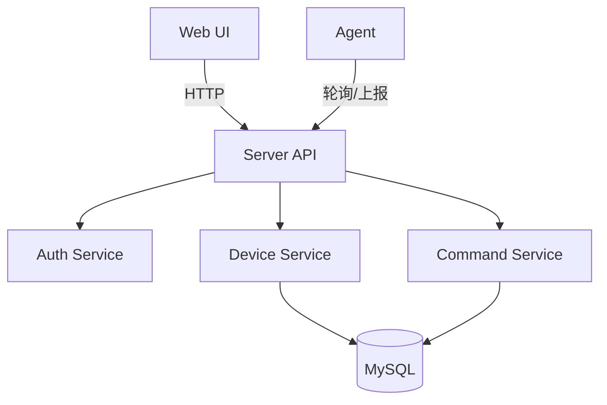

# 项目概览

> **最后更新**: 2025-06-20  
> **文档状态**: 正式发布

---

## 系统架构图



---

## 核心组件

### 1. Web UI
- **技术栈**: Vue3 + Vite + Naive UI + TypeScript
- **功能**: 设备管理、命令调度、状态监控
- **访问方式**: 浏览器访问，支持响应式设计

### 2. Server API
- **技术栈**: Go + Gin
- **功能**: 统一入口、路由分发、中间件处理
- **特性**: 支持限流、认证、日志记录

### 3. Auth Service
- **功能**: 用户认证、权限控制、Session 管理
- **认证方式**: Cookie + Session / API Key
- **权限模型**: 基于角色的访问控制 (RBAC)

### 4. Device Service
- **功能**: 设备注册、状态管理、分组管理
- **数据存储**: MySQL + GORM
- **状态跟踪**: 实时心跳检测

### 5. Command Service
- **功能**: 命令调度、执行跟踪、结果收集
- **调度类型**: 一次性、立即执行
- **执行模式**: 异步执行 + 状态回调

### 6. Agent
- **技术栈**: Go (跨平台)
- **功能**: 设备代理、命令执行、状态上报
- **通信方式**: HTTP + 轮询机制

---

## 数据流向

### 1. 设备注册流程
```
Agent → Server API → Device Service → MySQL
```

### 2. 命令下发流程
```
Web UI → Server API → Command Service → MySQL
Agent 轮询 → Command Service → Agent 执行 → 结果上报
```

### 3. 状态监控流程
```
Agent 心跳 → Device Service → MySQL
Web UI 查询 → Device Service → 实时状态展示
```

---

## 技术特点

### 🚀 轻量级设计
- **无中间件依赖**: 不依赖 Redis、Elasticsearch 等
- **最小化部署**: 仅需 MySQL 数据库
- **资源占用低**: 适合资源受限环境

### 🔐 安全可靠
- **无特殊 HTTPS 要求**
- **权限控制**: 细粒度的用户权限管理
- **数据加密**: 当前未做加密，后续可选（详见计划任务文档）

### 📱 灵活扩展
- **插件化架构**: 支持功能模块扩展
- **API 优先**: 提供完整的 RESTful API
- **多端支持**: Web、CLI（不支持 SDK）

---

## 部署架构

### 单机部署
```
┌─────────────────┐
│  Server API     │
├─────────────────┤
│     MySQL       │
└─────────────────┘
```

> 目前仅支持单机部署，无集群、负载均衡、Nginx、Docker 等方案，相关内容详见计划任务文档。

---

## 性能与安全计划

- 性能优化、加密、命令过滤等内容详见[计划任务文档](../development/plans.md)

---

## 相关文档

- [权限控制](./api/permissions.md) - 用户角色和权限说明
- [数据模型](./data-models.md) - 数据库设计和 ER 图
- [环境配置](../development/environment.md) - 部署环境配置
- [最佳实践](../development/best-practices.md) - 部署和运维建议 